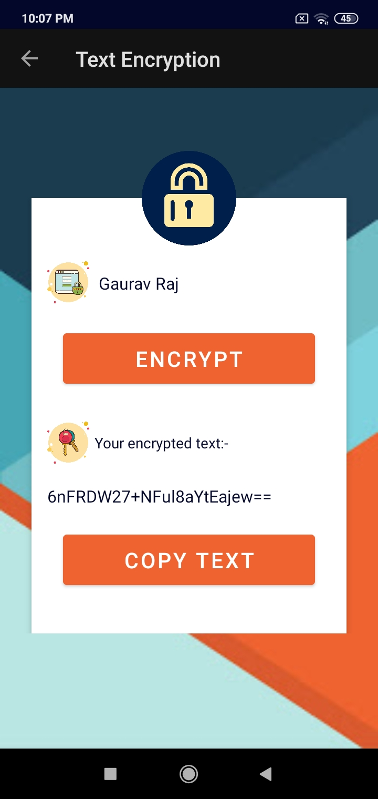
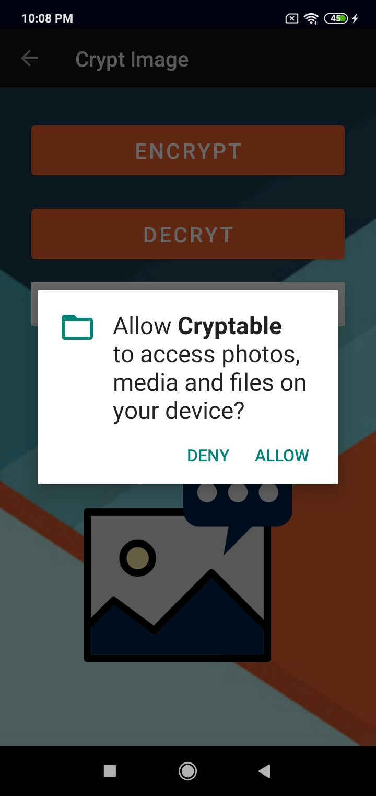
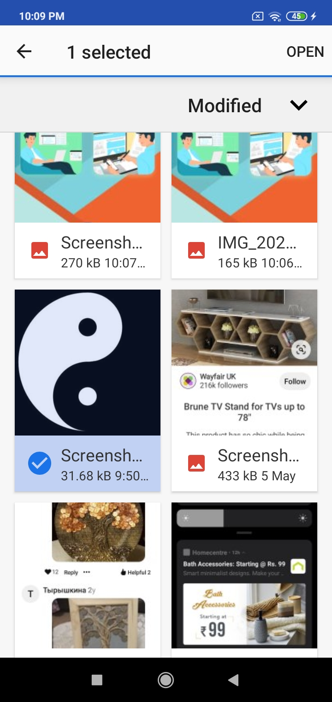
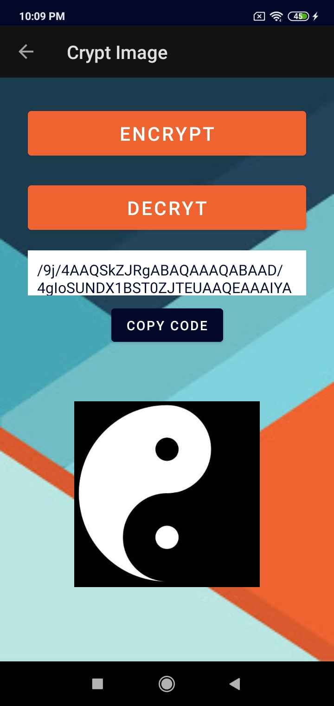

# Cryptable - Android Cryptography Project

- An Android App for encrypting and decrypting images and texts.
 

## Download App

## Developer
Gaurav Raj - [LinkedIn](https://www.linkedin.com/in/gaurav-raj-5893b0195/)

## Landing Screen

## Text Cryption

## Image Cryption

